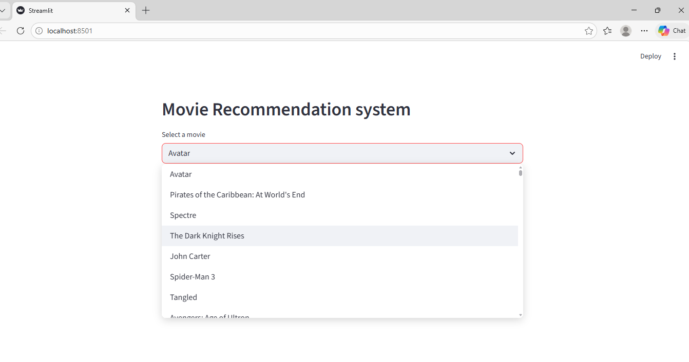

# 🎬 Movie Recommendation System

## 📌 Overview

This project is a **Movie Recommendation System** built using Machine Learning and NLP techniques.
It recommends movies to users based on similarity between movie features.

---

## 🚀 Features

* Recommend similar movies instantly
* Content-based filtering
* Clean and simple interface using Streamlit
* Fast and efficient recommendations

---

## 🛠️ Tech Stack

* Python
* Pandas, NumPy
* Scikit-learn
* NLP
* Streamlit

---

## 📂 Project Structure

```
project/
│── app.py
│── movie_recommendation.ipynb
│── requirements.txt
│── README.md
```

---

## 📊 Dataset

The dataset is too large to upload on GitHub.

👉 Download dataset from Google Drive:
(https://drive.google.com/drive/folders/1teD8hRdyW6eBapKmhyZwMNuQtwNE5otF)

After downloading, place the dataset in the project folder before running the app.

---

## 📒 Jupyter Notebook

The complete implementation is available in:

```
movie_recommendation.ipynb
```

---

## 📸 Screenshots
### Home Page


### Recommendation Result


---

## 🎯 Future Improvements

* Add collaborative filtering
* Improve recommendation accuracy
* Deploy the app online

---

## 🙌 Author
KRISHNA MALVIYA
